# True Self Directory

## Overview

This directory contains the complete True Self workplace wellness intelligence system, featuring structured data architecture, automation scripts, and expert content for personalized ergonomic assessments.

## Directory Content

### Core Components

_Enterprise-grade workplace wellness platform with AI-ready architecture._

- `data/` - Content intelligence engine with 979+ structured records
- `scripts/` - Automation pipeline for data processing and deployment
- `content/` - Expert wellness knowledge base across 13 specialized modules

## The Vision (Sales Story)

Imagine a workplace wellness platform that doesn't just ask questions—it **understands**. Where ergonomic assessments adapt in real-time, where personalized recommendations emerge from conversational AI, and where content management becomes as intuitive as having a dialogue with an expert colleague.

True Self represents a paradigm shift from static wellness surveys to **intelligent, adaptive guidance systems**. Built on a foundation of structured knowledge and designed for the age of conversational AI, it transforms how organizations deliver personalized workplace wellness at scale.

### What Makes This Different

**AI-Ready Architecture**: Every component designed for MCP (Model Context Protocol) integration, enabling natural language content management and AI-powered user interactions.

**Modular Content Evolution**: From monolithic structure to a modular library of resources and recommendations from INNoVA that adapts recommendations based on user responses, work environments, and emerging patterns.

### The Business Opportunity

**Market Position**: First-to-market intelligent workplace wellness platform combining expert ergonomic knowledge with conversational AI capabilities.

**Revenue Streams**:

- **Enterprise Licensing**: Scalable deployment across organizations
- **AI Enhancement Services**: Custom conversational interfaces and content adaptation
- **Content Marketplace**: Specialized modules for industry-specific wellness needs
- **Analytics & Insights**: Workplace wellness intelligence and benchmarking

**Competitive Advantages**:

- **Technical Moat**: Relationship-driven content architecture that competitors cannot easily replicate
- **AI-Native Design**: Built for the conversational AI revolution, not retrofitted
- **Expert Knowledge Base**: 979+ pieces of structured wellness expertise ready for AI enhancement

## Implementation

### Phase 1: Foundation Deployment

#### Immediate Platform Refactor

- Backend database restructure to support new information architecture
- Cleaner onboarding process and discover module navigation
- Editable content by INNoVA staff

### Phase 2: AI Enhancement

#### Competitive Differentiation

- MCP integration enabling conversational content management
- AI-powered assessment personalization beyond rule-based logic
- Natural language resource discovery and recommendation explanation

### Phase 3: Platform Evolution

#### Market Leadership

- Multi-modal assessment interfaces (voice, visual, text)
- Predictive wellness analytics and intervention recommendations
- Industry-specific content marketplaces and partnership ecosystem

## Visuals

### Information Architecture & Data Flow

#### Complete System Flow

```mermaid
flowchart TD
    subgraph "PHASE 1: ONBOARDING SYSTEM"
        A["👤 Account Registration<br/>(Personal Info + Auth)"]
        B["🏢 Work Classification<br/>(17 Questions → Work Type)"]
        C["🎯 Module Assignment<br/>(Filter 13 Modules by Work Type)"]
    end

    subgraph "PHASE 2: DISCOVERY SYSTEM"
        D["📋 Module Selection<br/>(User Chooses from Available Modules)"]
        E["❓ Dynamic Assessment<br/>(79 Questions with Conditional Logic)"]
        F["✅ Response Collection<br/>(208 Answer Options)"]
        G["💡 Recommendation Engine<br/>(144 Personalized Suggestions)"]
        H["🔗 Resource Delivery<br/>(148 Implementation Tools)"]
    end

    subgraph "DATA ARCHITECTURE"
        I["📊 Content Management<br/>(Admin Updates via TSV Files)"]
        J["🔥 Firebase Database<br/>(Real-time Data Sync)"]
        K["🏷️ Organization System<br/>(Tags: 4 Categories, Topics: 45 Headers)"]
    end

    %% User flow
    A --> B
    B --> C
    C --> D
    D --> E
    E --> F
    F --> G
    G --> H

    %% Data flow
    I --> J
    J --> B
    J --> E
    K --> D
    K --> G
    K --> H

    %% Color coding by system phase
    style A fill:#e1f5fe,stroke:#0277bd
    style B fill:#e8f5e8,stroke:#2e7d32
    style C fill:#fff8e1,stroke:#f57c00
    style D fill:#e1f5fe,stroke:#0277bd
    style E fill:#fff3e0,stroke:#ef6c00
    style F fill:#e8f5e8,stroke:#2e7d32
    style G fill:#fff8e1,stroke:#f57c00
    style H fill:#fce4ec,stroke:#c2185b
    style I fill:#f1f8e9,stroke:#388e3c
    style J fill:#ffecb3,stroke:#ff8f00
    style K fill:#f3e5f5,stroke:#7b1fa2
```



## Data Architecture

### Core Data Relationships

The system operates on 10 interconnected data tables that drive the entire user experience:

```mermaid
flowchart TD
    subgraph "ONBOARDING SYSTEM"
        direction TB
        A["onboarding-questions.tsv<br/>📧 17 Questions<br/>(Account + Work Classification)"]
        B["onboarding-options.tsv<br/>⚙️ Answer Options"]
        C["onboarding-modules.tsv<br/>📝 4 Module Categories"]
    end

    subgraph "DISCOVERY SYSTEM"
        direction TB
        D["modules.tsv<br/>📋 13 Workplace Modules"]
        E["topics.tsv<br/>🏷️ 45 Organizational Tags"]
        F["questions.tsv<br/>❓ 79 Assessment Questions"]
        G["options.tsv<br/>✅ 208 Answer Options"]
        H["recommendations.tsv<br/>💡 144 Personalized Recommendations"]
        I["resources.tsv<br/>🔗 148 External Resources"]
        J["tags.tsv<br/>📂 4 Main Categories:<br/>My Space, My Focus, My Balance, My Habits"]
    end

    %% System connections
    A --> B
    B --> C
    C --> D

    %% Discovery data flow
    D --> F
    E -.-> F
    F --> G
    G --> H
    H --> I
    J --> D
    J --> H
    J --> I

    %% Color coding for data types
    style A fill:#e1f5fe,stroke:#0277bd
    style B fill:#e8f5e8,stroke:#2e7d32
    style C fill:#fff8e1,stroke:#f57c00
    style D fill:#e1f5fe,stroke:#0277bd
    style E fill:#f3e5f5,stroke:#7b1fa2,stroke-dasharray: 5 5
    style F fill:#fff3e0,stroke:#ef6c00
    style G fill:#e8f5e8,stroke:#2e7d32
    style H fill:#fff8e1,stroke:#f57c00
    style I fill:#fce4ec,stroke:#c2185b
    style J fill:#f1f8e9,stroke:#388e3c
```



### Data Flow Process

#### Phase 1: Onboarding System

1. **Account Registration**: User provides personal information and authentication
2. **Work Classification**: User answers 17 onboarding questions to determine work environment type
3. **Module Assignment**: System determines which of the 13 discovery modules are relevant based on work type

#### Phase 2: Discovery System

1. **Module Selection**: User chooses from available specialized workplace modules (filtered by work type)
2. **Dynamic Assessment**: System presents contextual questions from the 79-question pool based on selected module
3. **Conditional Logic**: Follow-up questions appear based on previous answers and prerequisite relationships
4. **Response Collection**: User selections are captured from 208 available answer options
5. **Recommendation Engine**: System generates personalized suggestions from 144 recommendation pool
6. **Resource Delivery**: External implementation tools and guides provided from 148 curated resources

#### Data Relationships

- **Tags System**: 4 main categories (My Space, My Focus, My Balance, My Habits) organize modules, recommendations, and resources
- **Topics System**: 45 organizational headers provide additional content classification and filtering

## Modules & Data Structure

### Data Source Files (true-self/data/source/)

#### Onboarding System

- `onboarding-modules.tsv` - Account setup flow categories
- `onboarding-questions.tsv` - User classification questions
- `onboarding-options.tsv` - Answer choices for setup

#### Discovery System

- `discover-modules.tsv` - 13 workplace assessment modules
- `discover-topics.tsv` - 45 content organization headers
- `discover-questions.tsv` - 79 dynamic assessment questions
- `discover-options.tsv` - 208 answer pathways
- `discover-recommendations.tsv` - 144 personalized guidance items
- `discover-resources.tsv` - 148 external implementation tools
- `discover-tags.tsv` - 4 main categories (My Space, My Focus, My Balance, My Habits)

### Module Categories & Topics

#### My Space - Physical Ergonomics

**Workplace environment optimization**

1. **Static Standing Environments** - Cashiers, retail workers, factory floors

   - Topics: Standing desks, anti-fatigue mats, posture support

2. **Moving & Walking Environments** - Warehouse, retail, healthcare workers

   - Topics: Footwear, floor surfaces, movement patterns

3. **Parcel Delivery & Couriers** - Package handling, vehicle ergonomics

   - Topics: Lifting techniques, vehicle setup, route planning

4. **Long Haul Truck Drivers** - Extended driving, rest management

   - Topics: Seat adjustment, break scheduling, sleep hygiene

5. **Bus & Transit Operators** - Public transportation ergonomics

   - Topics: Driver position, passenger interaction, shift patterns

6. **Rideshare & Taxi Drivers** - Urban driving conditions

   - Topics: Vehicle ergonomics, break management, customer safety

7. **Emergency Vehicle Operators** - High-stress driving environments

   - Topics: Equipment accessibility, stress management, rapid response

8. **Workplace Adjustments** - Office environment optimization

   - Topics: Desk height, monitor position, lighting, temperature

#### My Focus - Digital Accessibility

**Technology interaction optimization**

1. **Input & Interaction Ergonomics** - Keyboard, mouse, touch interfaces

   - Topics: Input device selection, hand positioning, accessibility features

2. **Document & Screen Positioning** - Display ergonomics, eye strain prevention

   - Topics: Monitor height, viewing distance, lighting, break reminders

#### My Balance - Mental Wellness

**Stress and energy management**

1. **Fatigue & Wellness Strategies** - Energy management, break scheduling

   - Topics: Sleep optimization, stress reduction, work-life balance

#### My Habits - Behavioral Change

**Productivity and routine optimization**

- Digital accessibility support
- Efficiency & productivity strategies
- Mental health & stress management

## Capabilities Through MCP Integration

### Conversational Content Management

#### Transform Static Editing into Natural Dialogue

```typescript
// Example MCP Content Operations
interface ConversationalCMS {
  // Natural language content updates
  updateContent(instruction: string): Promise<ContentChange>;
  // "Add a recommendation for standing desk users about monitor height"

  // Intelligent relationship management
  validateRelationships(): Promise<RelationshipReport>;
  // Automatically detect and resolve content dependencies

  // AI-powered content generation
  generateQuestions(moduleContext: string): Promise<Question[]>;
  // Create contextually relevant assessment questions
}
```

### Intelligent Assessment Flows

#### Beyond Rule-Based Logic to AI Understanding

- **Semantic Resource Discovery**: Natural language queries find relevant implementation tools
- **Personalized Explanation**: AI explains why specific recommendations matter to individual users

### Multi-Modal Intelligence Platform

#### Ready for Voice, Visual, and Conversational Interfaces

- **Voice-Based Assessments**: Accessibility-first design for hands-free interaction
- **Visual Workspace Analysis**: Upload workspace photos for AI-powered ergonomic analysis
- **Progressive Disclosure**: AI determines optimal information timing based on user engagement
- **Contextual Resource Discovery**: "Show me standing desk options under $500 with good reviews"
- **Contextual Guidance**: Real-time assistance during assessment completion
- **Dynamic Question Generation**: AI creates follow-up questions based on conversation context

## MCP Integration Architecture

### Conversational Content Management Layer


