# Data Directory

## Overview

This directory contains structured data optimized for Firebase import, supporting discovery modules, assessments, and onboarding flows with relational integrity.

## Directory Content

### Source Data (.tsv)

_*Tab-separated values optimized for Firebase document structure.*_

- `discover-modules.tsv` - Module definitions with Firebase-ready IDs
- `discover-questions.tsv` - Assessment questions with prerequisite logic
- `discover-options.tsv` - Answer options linked to questions via foreign keys
- `discover-recommendations.tsv` - Conditional recommendations with targeting rules
- `discover-resources.tsv` - External resources with Firebase-compatible metadata
- `discover-tags.tsv` - Classification tags for Firestore querying
- `discover-topics.tsv` - Topic hierarchy with parent-child relationships
- `onboarding-modules.tsv` - Onboarding flows with sequence ordering
- `onboarding-questions.tsv` - Initial assessment with branching logic
- `onboarding-options.tsv` - Answer choices with prerequisite mappings

### Exported Data (.json)

_*Firebase-ready JSON documents with proper collection structure.*_

- `discover-modules.json` - Modules as Firestore documents with subcollections
- `discover-questions.json` - Questions with embedded prerequisite arrays
- `discover-options.json` - Options with question ID references
- `discover-recommendations.json` - Recommendations with conditional targeting
- `discover-resources.json` - Resources with Firebase Storage URLs
- `discover-tags.json` - Tags with usage counts and relationships
- `discover-topics.json` - Topics with hierarchical structure
- `onboarding-modules.json` - Onboarding with sequence metadata
- `onboarding-questions.json` - Questions with branching conditions
- `onboarding-options.json` - Options with next-question routing
- `firebase-import.json` - Complete import payload for Firebase Admin SDK

## Data Relationships

```mermaid
graph LR
    subgraph "Discovery System"
        A["discover-modules.tsv<br/>📋 13 Modules"] --> B["discover-questions.tsv<br/>❓ 79 Questions"]
        B --> C["discover-options.tsv<br/>✅ 208 Answers"]
        C --> D["discover-recommendations.tsv<br/>💡 144 Suggestions"]
        D --> E["discover-resources.tsv<br/>🔗 148 External Links"]

        F["discover-topics.tsv<br/>🏷️ 45 Headers"] -.-> B
        G["discover-tags.tsv<br/>📂 4 Categories"] --> A
        G --> D
        G --> E
    end

    subgraph "Onboarding System"
        H["onboarding-modules.tsv<br/>📝 Account Setup"]
        I["onboarding-questions.tsv<br/>📧 User Details"]
        J["onboarding-options.tsv<br/>⚙️ Configuration"]

        H --> I
        I --> J
    end

    style A fill:#e1f5fe
    style B fill:#fff3e0
    style C fill:#e8f5e8
    style D fill:#fff8e1
    style E fill:#fce4ec
    style F fill:#f3e5f5,stroke-dasharray: 5 5
    style G fill:#f1f8e9
    style H fill:#e3f2fd
    style I fill:#f9fbe7
    style J fill:#fff3e0
```

